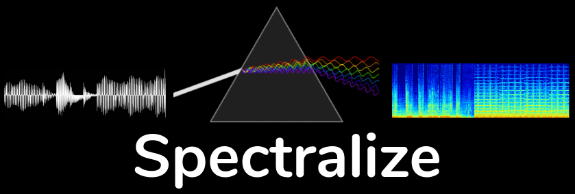

Decompressing audio files for rapid ML exploration

## Table of Contents
1. [Overview](#about)
2. [Engineering Design](#engineering-design)
3. [Deployment](#deployment)
4. [Credits](#credits)
5. [Reference](#references)


## Overview

Audio data is ubiquitous and valuable.

## Engineering Design

### Processing Pipeline

~[Tech stack diagram](.docs/spectralize_techstack.png)

Based on Python.

Dependencies

Python libraries
Anaconda (Python3.7)
- tinytag: extract metadata tags from audio files
- librosa: perform audio-processing computations and feature extraction
- numpy
- pandas
- psycopg2
- boto3


### Processing Logic

The processing log is based on signal processing provided by the [Librosa](https://librosa.org/) library, specifically the Mel-spectrogram decomposition.

### Data Source

Assorted audio files were uploaded to S3.

## Deployment

Spectralize was developed and deployed using [Amazon Web Services](https://aws.amazon.com) cloud computing platform

### EC2 Configuration

Role | Spark | TimescaleDB | Dash
---: | :---: | :---: | :---: 
**Type** |  m5.large | m5.large | m5.large 
**Number** | 2 | 5 | 5 

### Spark

[Download](https://spark.apache.org/downloads.html) and install Spark 2.4.3 pre-built with Apache Hadoop 2.7+ on instances running Ubuntu 18.04 LTS. Install Python 3.7.3 and Python packages:

```bash
python3.7 -m pip -r config/sparkcluster-requirements.txt
```

### PSQL/TimescaleDB


### Dash


## Credits

Spectralize was developed by Dylan Royston ([LinkedIn Profile](https://www.linkedin.com/in/dylanroyston/)). This project was a deliverable from my fellowship in the Insight Data Engineering program in June 2020 in Silicon Valley, CA, United States.

## References


