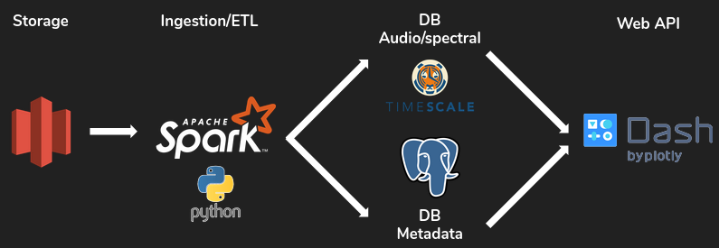

Decompressing audio files for rapid ML exploration

## Table of Contents
1. [Overview](#about)
2. [Engineering Design](#engineering-design)
3. [Deployment](#deployment)
4. [Credits](#credits)
5. [Reference](#references)


## Overview

Audio data is ubiquitous in the modern world, and highly valuable to a wide array of industries and applications. Many companies rely on insights gained from applying machine learning algorithms to various audio datasets. While many such applications are based on defined summary statistics, more recent deep learning approaches rely on processing as many data features as possible. Spectralize is a platform designed to process and decompress common audio files into fully indexed spectral features, enabling rapid use for analysis and ML exploration.

## Engineering Design

### Processing Pipeline



Spectralize is based on Python, implementing Spark dataframes and transforming data from AWS S3 into indexed PSQL/TimescaleDB tables.

Core Dependencies

Anaconda (Python3.7)
- tinytag: extract metadata tags from audio files
- librosa: perform audio-processing computations and feature extraction
- pyspark: enable Spark functions
- numpy: numerical and linear algebra operations
- pandas: intermediate dataframes
- psycopg2: psql interaction
- boto3: AWS S3 interaction


### Processing Logic

The processing log is based on signal processing provided by the [Librosa](https://librosa.org/) library, specifically the Mel-spectrogram decomposition. Acoustic data is decomposed into human-perceptible frequency-power and stored for easy access and retrieval.

### Data Source

Assorted audio files were uploaded to S3 (5332 files, ~30GB).

## Deployment

Spectralize was developed and deployed using [Amazon Web Services](https://aws.amazon.com) cloud computing platform

### EC2 Configuration

Role | Spark | TimescaleDB | Dash
---: | :---: | :---: | :---: 
**Type** |  m5.large | m5.large | m5.large 
**Number** | 2 | 5 | 5 

### Spark

[Download](https://spark.apache.org/downloads.html) and install Spark 2.4.3 pre-built with Apache Hadoop 2.7+ on instances running Ubuntu 18.04 LTS. Install Python 3.7.3 and Python packages:

```bash
python3.7 -m pip -r config/sparkcluster-requirements.txt
```

### PSQL/TimescaleDB


### Dash


## Credits

Spectralize was developed by Dylan Royston ([LinkedIn Profile](https://www.linkedin.com/in/dylanroyston/)). This project was a deliverable from my fellowship in the Insight Data Engineering program in June 2020 in Silicon Valley, CA, United States.

## References


